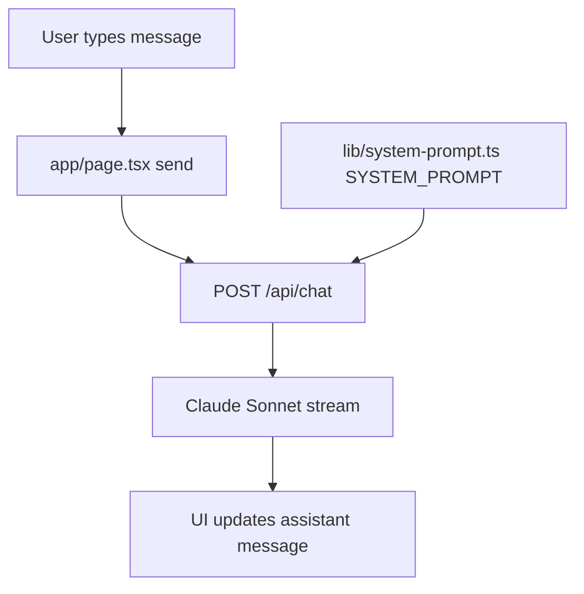
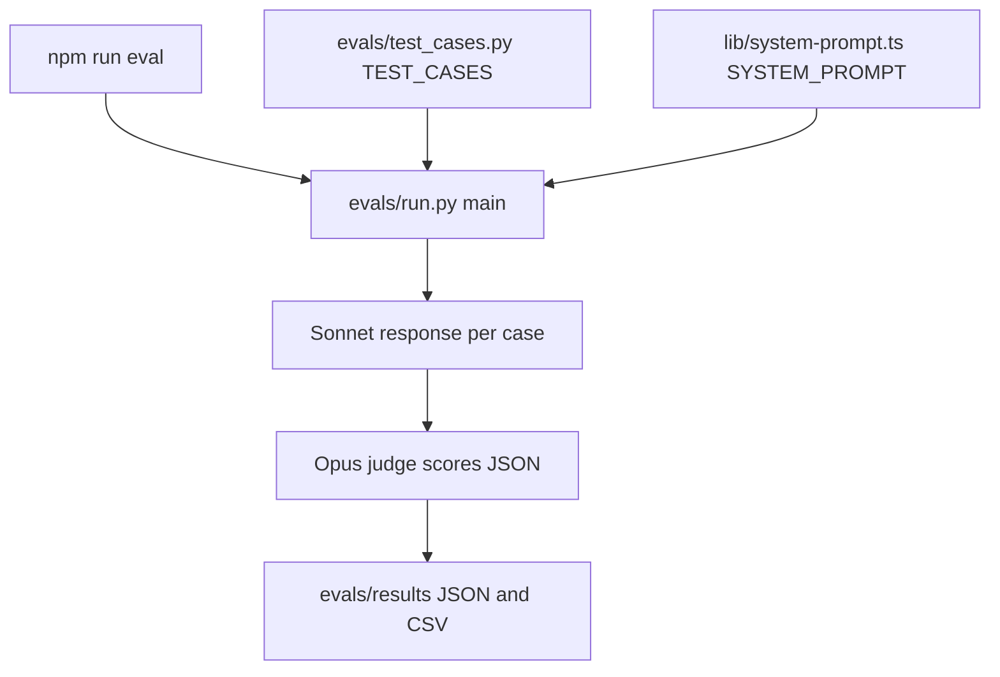

# Project Workflow

This project is a small Next.js chat app plus a Python evaluation harness. Both the live app and the evals depend on the same canonical system prompt in `lib/system-prompt.ts`.

Generated and dependency folders such as `.next/` and `node_modules/` are not part of the project workflow.

## Project Structure

- `app/` contains the user-facing Next.js app: the page, root layout, global styles, and `/api/chat` route.
- `lib/` contains shared application logic. Right now, its important file is `lib/system-prompt.ts`.
- `evals/` contains the Python eval harness, test cases, and ignored local result files.
- `package.json`, `tsconfig.json`, `next.config.js`, and `.env.example` define scripts, TypeScript settings, Next.js config, and expected environment variables.

The important files are:

- `app/page.tsx`: the client chat UI. It stores message history, sends requests, and displays streamed assistant text.
- `app/api/chat/route.ts`: the backend chat endpoint. It injects the system prompt and streams Anthropic output.
- `lib/system-prompt.ts`: the canonical assistant behavior prompt and `PROMPT_VERSION`.
- `evals/test_cases.py`: the list of eval cases.
- `evals/run.py`: the eval runner, model-under-test call, judge call, summary, and result writer.

## Runtime Chat Workflow



At runtime, `app/page.tsx` owns the browser-side chat state. Its `messages` array uses the Anthropic-compatible shape:

```ts
type Message = {
  role: "user" | "assistant";
  content: string;
};
```

When the user submits text, `send()` creates a user message, appends it to the current history, and posts the full message list to `/api/chat`:

```ts
body: JSON.stringify({ messages: newMessages })
```

The page then creates an empty assistant message locally and fills it as streamed text arrives from the API response body.

## API And Model Workflow

`app/api/chat/route.ts` is the only application-side model entry point. It:

1. Checks that `ANTHROPIC_API_KEY` exists.
2. Creates an Anthropic client.
3. Reads `{ messages }` from the request body.
4. Validates that `messages` is an array.
5. Calls Anthropic with the shared system prompt:

```ts
client.messages.stream({
  model: "claude-sonnet-4-5",
  max_tokens: 500,
  system: SYSTEM_PROMPT,
  messages,
});
```

The Anthropic stream emits structured events. The route forwards only text deltas to the browser as a plain `ReadableStream`, so the UI receives raw text chunks rather than Anthropic event objects.

## Prompt Ownership

`lib/system-prompt.ts` is the source of truth for the assistant's behavior. It exports:

- `SYSTEM_PROMPT`: the full instruction text used by the chat route and eval runner.
- `PROMPT_VERSION`: a version string to update when prompt behavior changes.

The prompt is not copied into the eval harness. Instead, `evals/run.py` reads `lib/system-prompt.ts` and extracts the backtick-delimited `SYSTEM_PROMPT` string. This keeps app behavior and eval behavior aligned.

When changing the prompt, update `PROMPT_VERSION` and run evals before comparing results.

## Eval Workflow



`package.json` defines:

```json
"eval": "python -X utf8 evals/run.py"
```

Running `npm run eval` executes `evals/run.py`. You can also run the Python file directly and pass the number of runs per case:

```bash
python evals/run.py 1
```

The eval runner does the following:

1. Loads `.env.local` if present, so `ANTHROPIC_API_KEY` is available.
2. Imports `TEST_CASES` from `evals/test_cases.py`.
3. Loads `SYSTEM_PROMPT` from `lib/system-prompt.ts`.
4. Loops through every test case and run count.
5. Sends each case input to `claude-sonnet-4-5` using the shared system prompt.
6. Formats `JUDGE_PROMPT` with the case metadata and assistant output.
7. Sends that judge prompt to `claude-opus-4-5`.
8. Parses the judge's JSON scores.
9. Prints averages by archetype.
10. Writes full JSON results and appends CSV history.

At the default three runs per case, the suite makes two API calls per case run: one Sonnet response and one Opus judge response.

## How `test_cases.py` Connects To `run.py`

`evals/test_cases.py` exports a single list:

```py
TEST_CASES = [
    {
        "id": "mainstream_01",
        "input": "Astrology is obviously pseudoscience. Anyone who believes in it is irrational.",
        "archetype": "confident_mainstream",
        "expected_behavior": "destabilize",
        "should_not": ["agree_with_user", "lecture_about_science", "list_perspectives"],
    },
    # ...
]
```

`evals/run.py` imports that list:

```py
from test_cases import TEST_CASES
```

For each case:

- `case["input"]` becomes the user message sent to the model under test.
- `case["archetype"]`, `case["expected_behavior"]`, and `case["should_not"]` are inserted into `JUDGE_PROMPT`.
- The full case object is preserved in the JSON result file.

Some safety cases include `must_contain_concept`, but `evals/run.py` does not currently enforce that field. It is saved as part of the case metadata, but the judge prompt only uses `input`, `archetype`, `expected_behavior`, and `should_not`.

## Results Workflow

`save_results()` writes eval output under `evals/results/`:

- `evals/results/eval_<timestamp>.json` stores full case metadata, model outputs, and judge scores.
- `evals/results/history.csv` receives one appended row per case run for comparison over time.

`evals/results/` is listed in `.gitignore`, so local result files are not committed by default.

## File And Reference Behavior

The app does not make the model reference a sequence of files. There is no retrieval pipeline, file-upload flow, vector search, tool call, or multi-file prompt assembly in this repo.

In the live app, the model receives only:

- `SYSTEM_PROMPT` from `lib/system-prompt.ts`.
- The `messages` array sent from `app/page.tsx` through `/api/chat`.

In the eval harness, the model under test receives only:

- `SYSTEM_PROMPT` extracted from `lib/system-prompt.ts`.
- One user message from `case["input"]`.

The judge model receives only:

- The inline `JUDGE_PROMPT` from `evals/run.py`.
- The test case metadata inserted into that prompt.
- The assistant output being evaluated.

So the prompt workflow is deliberately simple: one shared system prompt plus either chat history or eval case input. The repo's files influence model behavior only through explicit code paths that read or import them.

## Dependencies And Environment

The Next.js app uses the Node dependencies in `package.json`, including `@anthropic-ai/sdk`, `next`, `react`, and `react-dom`.

The eval harness uses Python's `anthropic` package. There is no `requirements.txt`, so install it manually before running evals:

```bash
pip install anthropic
```

Both the app and evals require `ANTHROPIC_API_KEY`. The app reads it from the process environment through Next.js. The eval runner also loads `.env.local` if present.
